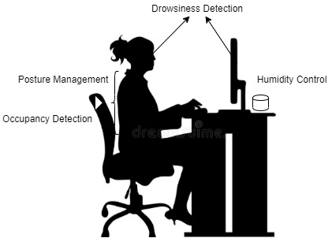
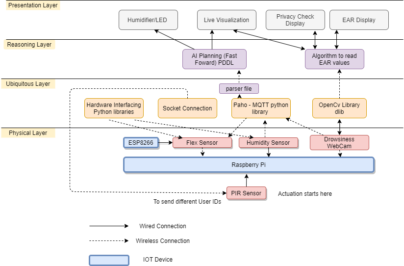

# Smart Monitoring of Health and Productivity at Work

This project aims at using IoT technology to improve employees' productivity at work. The drowsiness factor, posture, work time of the employee, the humidity of the surrounding environment is monitored. The collected data is analyzed, and the corresponding action is taken to facilitate a conductive work-friendly environment.

System Architecture - Content and Layers
---------------------------------------

